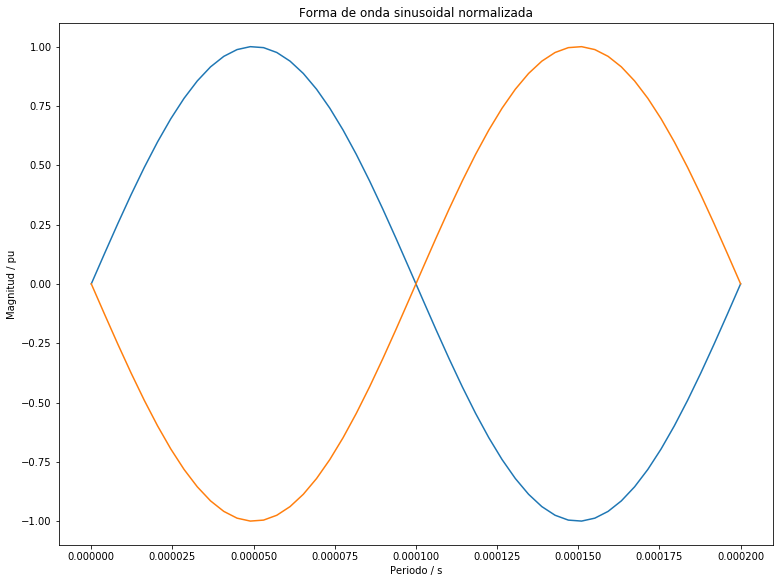

---
## Universidad de Costa Rica

### Escuela de Ingeniería Eléctrica

#### IE0405 - Modelos Probabilísticos de Señales y Sistemas
---
---
## Tarea 4: Modulación digital

### Pierre Durán Guzmán
### B42323
#### Grupo 01
---
El objetivo de esta tarea es hacer una modulación digital para "transmitir" estos datos por un canal ruidoso. La modulación se hace con una frecuencia en la portadora de f = 5000 Hz y con un período de símbolo igual a un período completo de la onda portadora.

### Punto 1)
Se creó un esquema de modulación BPSK para los bits presentados en el archivo bits10k.csv donde se encuentran 10.000 bits. Esto implica asignar una forma de onda sinusoidal normalizada para cada bit y luego una concatenación de todas estas formas de onda. 

Para esta solución, se procedió inicialmente a crear una forma de onda sinusoidal normalizada para cada bit con una frecuencia de 5000 Hz para la señal portadora. Dicha señal tiene la forma representada a continuación:

Luego, para crear el esquema de modulación BPSK es importante mencionar que este esquema es la modulación de desplazamiento de fase de 2 símbolos donde dichos símbolos suelen tener un valor de salto de fase de 0º para el 1 y 180º para el 0. Para este caso, si el bit leído es 1 la señal tendrá una forma de onda igual a la portador y si el bit leído es 0 entonces será la forma de onda inversa, es decir, desfasa 180º. A continuación, se muestra la Figura que representa el esquema de modulación BPSK con los primeros bits recibidos en 50 puntos de muestreo por periodo.

Donde pordemos corroborar, que si se recibe un bit 1, en ese intervalo tendremos la misma forma de onda que la portadora y si recibimos un bit de 0 entonces tendremos la inversa de la portadora.

### Punto 2)
Se procedió a calcular la potencia promedio de la señal modulada generada, es decir, la señal obtenida en el punto 1. Para ello, se procedió a obtener, inicialmente, la potencia instántanea de la señal la cual se calculó mediante la sumatoria de la señal al cuadrado. Luego, para la potencia promedio se realizó la integral de la potencia instantánea para cada período de cada bit. Obteniendo que:

La potencia promedio de la señal modulada generada es: 0.4900009800019598 W

Para 50 puntos de muestreo por período.

### Punto 3)
En este punto se simuló un canal ruidoso del tipo AWGN (ruido aditivo blanco gaussiano) con una relación señal a ruido (SNR) desde -2 hasta 3 dB. Sin embargo, para no relizar varias gráficas sobre el coportamiento del canal ruidoso para cada valor del intervalo del SNR, se procede a tomar el valor de 2dB que se encuentra dentro de dicho intervalo. Esto con el fin de observar el comportamiento general que presentará el canal ruidoso AWGN. 

Para obtener este canal, se procedió a utilizar la potencia promedio de la señal modulada y el SNR=2 para obtener un parámetro sigma que determinara el comportamiento normal (gaussiano) del ruido y que presentará la misma forma general que la señal modulada. Por lo que, este ruido (Rx) tendrá la forma de la señal del punto 1 pero con picos de ruido aditivo de tipo normal. A continuación, se observa una representación del canal ruidoso del tipo AWGN de los primeros 5 bits recibidos para 50 puntos de muestreo por periodo.

### Punto 4) 
Para este punto se graficó la densidad espectral de potencia de la señal con el método de Welch, antes y después del canal ruidoso. Este método de Welch, nos permite calcular una estimación de la densidad espectral de potencia dividiendo los datos en segmentos superpuestos, calculando un periodograma modificado para cada segmento y promediando los periodogramas. Para obtener la densidad espectral antes del ruido, se utiliza la señal modulada del punto 1, la frecuencia de muestreo (fs) y la longitud de cada segmento obteniendo la siguiente grafica:

Luego, para obtener la densidad espectral de potencia de la señal después del canal ruidoso utlizamos dentro de la función signal.welch la señal Rx obtenida en el punto 3 que consiste en una señal que suma la señal mudulada con el ruido gaussiano que se creó. Además de esta señal, se utiliza la frecuencia de muestre y la asignación de la longitud de cada segmento. A continuación, se muestra la grafica obtenida:

### Punto 5)

Hay un total de 12.0 errores en 10000 bits para una tasa de error de 0.0012 para SNR de -2.0.
Hay un total de 3.0 errores en 10000 bits para una tasa de error de 0.0003 para SNR de -1.0.
Hay un total de 1.0 errores en 10000 bits para una tasa de error de 0.0001 para SNR de 0.0.
Hay un total de 0.0 errores en 10000 bits para una tasa de error de 0.0 para SNR de 1.0.
Hay un total de 0.0 errores en 10000 bits para una tasa de error de 0.0 para SNR de 2.0.
Hay un total de 0.0 errores en 10000 bits para una tasa de error de 0.0 para SNR de 3.0.

